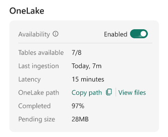

+++
date = '2026-04-26T14:22:00Z'
draft = false
title = "Demystifying Eventhouse OneLake Availability: Why mirroring isn't real-time"
+++

This week, I collaborated in an interesting support case regarding Eventhouse on Fabric's Real-Time Intelligence (RTI). A customer had enabled [OneLake Availability](https://learn.microsoft.com/en-us/fabric/real-time-intelligence/event-house-onelake-availability) on their Eventhouse tables. Naturally, they expected the feature to mirror their streaming data into their Lakehouse in a matter of seconds. Instead, they noticed it was taking several minutes for the data to surface in the Delta table.

Example:


If you are encountering this same delay, I want to be entirely straightforward: **at the time of writing, this is the expected behavior.** It is easy to assume that because Eventhouse handles real-time ingestion so beautifully, its OneLake mirroring capabilities would do the same. However, the mechanics of how data is flushed to OneLake fundamentally shift the architectural goal from *real-time streaming* to *optimized batch querying*. 

## The "Small File" problem and adaptive buffering

To understand the delay, we have to look at how data is written to OneLake. When OneLake Availability is turned on, Eventhouse mirrors the table as a **Delta Lake** table. 

If Eventhouse immediately wrote every single incoming record to OneLake as it arrived, it would generate thousands of tiny data files. This is a well-known Delta Lake anti-pattern. Having too many small files severely degrades query performance for any engine (like Spark or the SQL endpoint) trying to read that data.

To protect your downstream performance, Eventhouse uses an **adaptive buffering behavior**. Instead of flushing data instantly, it holds the data and writes it in larger, optimized batches. 

By default, Eventhouse waits until the data reaches an optimal file size, typically **200 to 256 MB**, or until a time limit is reached.

## Can we make it faster? The latency trade-off

You can force Eventhouse to flush data more frequently by altering the mirroring policy. At the time of writing, the minimum supported target latency is 5 minutes: 

```kusto
.alter-merge table YourTableName policy mirroring dataformat=parquet 
with (IsEnabled=true, TargetLatencyInMinutes=5);
```
While 5 minutes is not what most people would consider near real-time, it is currently the lowest latency allowed by the platform.

Lowering the latency increases how frequently data is written, which may create many small Parquet files; and usually in a Lakehouse, you would run an `OPTIMIZE` command to compact small files and `VACUUM` to clean up the old ones. However, as of right now, **mirrored Eventhouse tables are read-only in OneLake**. Maintenance operations are not supported. 

*(Note: `TargetLatencyInMinutes` is a target, not a strict SLA. Eventhouse will aim for this interval, but variations in actual latency are expected).*

## The right tool for the right job

Because of these architectural realities, you need to align your business requirements with the correct compute engine.

### When to use Eventhouse (KQL)
If your scenario demands **near real-time investigation**, alerts, or dashboards that must reflect the state of the world up to the current second, you should not be reading from the mirrored OneLake shortcut. 

You should query the data **directly in Eventhouse using KQL**. The Kusto engine is specifically designed to query data the millisecond it lands, handling both the in-memory streaming rowstore and the compressed columnstore seamlessly.

### When OneLake Availability makes sense
OneLake Availability is not for real-time; it is built to break down data silos without duplicating ingestion pipelines. It shines in scenarios where a slight delay (minutes to a few hours) is acceptable:

* **Cross-engine analytics:** You want to join your telemetry/log data in Eventhouse with your dimension tables (like CRM or ERP data) sitting in a Lakehouse or Warehouse using T-SQL.
* **Machine learning:** Your data science teams want to train models using Spark notebooks against massive volumes of historical event data.
* **Downstream BI:** You are building Power BI reports in Direct Lake mode where near real-time updates are not a hard business requirement.

## Operational visibility

If you ever need to verify what is happening behind the scenes, you can use KQL directly on your Eventhouse database to inspect the mirroring status:

* **Check the policy:** `.show table YourTableName policy mirroring`
* **Monitor the latency:** `.show table YourTableName operations mirroring-status`
* **Check for failures:** `.show table YourTableName operations mirroring-failures`

In summary, OneLake Availability is a powerful feature for unifying your data estate, provided you understand its batch-oriented nature. For true real-time needs, KQL remains your best friend.

See you in the next post :)