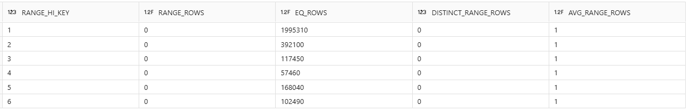
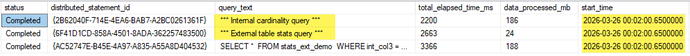
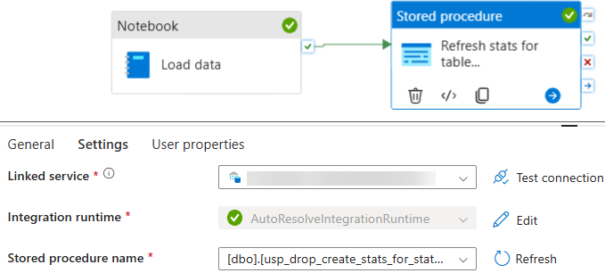

+++
date = '2026-03-27T00:00:00Z'
draft = false
title = 'Statistics strategy for external tables in Synapse Serverless SQL pool'
+++


## What exactly is a SQL statistic?

Before we dive into the details on Synapse Serverless SQL, let's quickly cover what a SQL statistic actually is. Simply put, it is a small object inside the database that contains information about how the data is distributed in a specific column. It helps the database engine understand what the data looks like without having to scan the entire table first.

Take a look at the image below. This is what a SQL statistic looks like under the hood. In this example, it shows the data distribution for a column called `PassengerCount` inside a `Trip` table:



Imagine you write a simple query like this: 
`SELECT * FROM Trip WHERE PassengerCount = 1`

Because of this statistic object, the SQL engine immediately knows that `1` is the most common value in that column. It knows right away that there are almost 2 million rows (1,995,310 to be exact) where the passenger count is 1. The engine uses this information to plan the fastest way to execute the query. 

## Automatic statistics creation behavior

The Serverless SQL pool creates statistics automatically at query execution time. If you use a column in a `WHERE`, `JOIN`, `GROUP BY`, `ORDER BY`, or `DISTINCT` clause and it doesn't have a statistic yet, the engine will automatically generate one for you before running the query itself. This is a **synchronous** process and, despite its clear benefits, it can extend the total execution time of the user's query. Subsequent executions benefit from the newly created statistics, but the first run may be penalized.

### Seeing the automatic creation in action

You can actually see this happening by querying `sys.dm_exec_requests_history`. Take a look at the image below. When I ran a SELECT on the `stats_ext_demo` table, you can see that SQL automatically fired off 2 background tasks at the exact same time: an **Internal cardinality query** and **External table stats**.


## The key limitation for external tables: no automatic stats updates

The most crucial point regarding external tables is that the Serverless SQL pool creates statistics automatically on them, but it **never updates those statistics automatically**. Over time, especially after data loads, these statistics can become stale and lead to terrible execution plans. Ideally, users should choose one of the options below to avoid ending up with external tables backed by  useless statistics:

### 3 ways to fix stale statistics

* **Recreate the external table periodically**: when you drop the table, the associated statistics are also dropped. When the first queries access the table again, statistics will be created automatically. As mentioned earlier, the first queries may be penalized due to the additional time required to generate the statistics.

* **Periodically drop the statistics created by Serverless**: after dropping them, when the first queries access the table, statistics will be recreated automatically. Again, the first queries may experience additional latency due to synchronous creation.

* **Maintain statistics manually**: recreate statistics periodically, ideally right after data loads. This avoids unexpected latency during query execution.

### My recommendation: Automate it after data loads

For me, the third option is the best approach. It provides full control, more consistency, and avoids performance surprises during critical workloads.

A very simple way to do this is to create a stored procedure in your Serverless SQL Pool. You can put the commands to drop and recreate statistics for your most important tables and columns inside it. Then, you just call that stored procedure at the very end of your data load pipeline:



## How to inspect statistics on external tables

To check the current state of statistics on your external tables, you can use the SQL command below. In this query, the main view is `sys.stats`, which stores details about the statistics created in the database:

```sql
SELECT 
   schema_name(o.schema_id) AS [schema_name],
   object_name(o.object_id) AS [table_name],
   o.create_date AS [table_date_create],
   DATEDIFF(MINUTE, o.create_date, GETDATE()) AS [minutes_since_creation],
   c.name AS [column_name],
   STATS_DATE(s.object_id, s.stats_id) AS [stats_date],
   'CREATE STATISTICS [' + 'Stats_' + c.name + '] ON [' + schema_name(o.schema_id) + '].[' + object_name(o.object_id) + '] ([' + c.name + ']) WITH FULLSCAN;' AS cmd_create,
   'DROP STATISTICS [' + schema_name(o.schema_id) + '].[' + object_name(o.object_id) + '].[' + 'Stats_' + c.name + '];' AS cmd_drop,
   'DROP STATISTICS [' + schema_name(o.schema_id) + '].[' + object_name(s.object_id) + '].[' + s.name + '];' AS cmd_drop_existing
FROM sys.objects AS o
INNER JOIN sys.columns AS c 
   ON o.object_id = c.object_id
LEFT JOIN sys.stats_columns AS sc 
   ON sc.object_id = c.object_id AND sc.column_id = c.column_id
LEFT JOIN sys.stats AS s
   ON s.object_id = sc.object_id AND s.stats_id = sc.stats_id
WHERE o.type = 'U'
ORDER BY [schema_name], [table_name], [column_name];
```

### Understanding the script results

If the `stats_date` field is `NULL`, it indicates that the column does not have a statistic. You can then copy the contents of the `cmd_create` column, paste it into a new SQL session, and create the missing statistics. Preferably, keep the FULLSCAN clause (while it may slightly increase the time required to create the statistic, it will produce a statistic that more accurately represents the actual data distribution in the table columns).

After data loads, consider dropping and recreating the statistics for the affected tables. Since the Serverless SQL pool does not support auto update statistics, the recommended approach is straightforward: drop the statistic and create it again.

See you in the next post :)