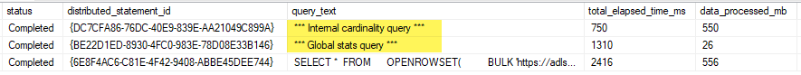

+++
date = '2026-03-29T08:16:00Z'
draft = false
title = 'Understanding OPENROWSET statistics in Synapse Serverless SQL pool'
+++

Sunday morning here... instead of watching the news (pretty bad lately), I'm just sitting here with my second coffee and trying to find that hour I lost moving to UTC+1 summer time :)

Anyway, since I'm already caffeinated, I think it is a good time to follow up on my [previous post](), where I discussed statistics for external tables in Synapse Serverless SQL pool. Today, let's shift the focus to **statistics for OPENROWSET queries**.

## What is OPENROWSET and why do stats matter?

If you are not familiar with OPENROWSET, it allows you to query data directly from a data lake without creating external tables. You simply write a SELECT statement that points to the file path, like this:

```sql
SELECT
    TOP 10 cc_call_center_id, cc_call_center_sk, cc_city
FROM
    OPENROWSET(
        BULK 'https://adls_path.dfs.core.windows.net/tables/tpcds_10gb/call_center/**',
        FORMAT = 'PARQUET'
    ) AS [result]
WHERE cc_call_center_id = 100
ORDER BY cc_city ASC
```

Just like with external tables, the Serverless SQL pool needs statistics to run OPENROWSET queries fast. These stats describe how your data is distributed across the files in the data lake. This helps the query optimizer estimate row counts and use resources well.

## How Serverless handles OPENROWSET stats behind the scenes

An interesting point about OPENROWSET statistics is that they work at the **server level**. It does not matter which database you are using when the stats are created; they are stored centrally and can be reused by queries running from any database in your pool. Because of this *global* behavior, when the system automatically creates stats for your columns, you will see a background operation called "Global stats query":



One big advantage over external tables is that Serverless **automatically creates and updates statistics** for OPENROWSET queries. It will trigger an update automatically whenever data changes reach a certain threshold (you can check the specific formula on [this link](https://learn.microsoft.com/en-us/sql/relational-databases/statistics/statistics?view=sql-server-ver17#auto_update_statistics-option)).


## When should you create statistics manually?

But in some situations, you might want more control over this. For example, right after your daily data load runs, you could create the stats ahead of time just to make sure you have fresh statistics; this gives you a much better chance of getting a good execution plan for your critical queries.

Also, by default, Serverless builds stats using just a small sample of the data. In a few edge cases (especially when your data is highly skewed) this small sample is not enough. You might need stats based on 100% of the data in a column (`FULLSCAN`). In those cases, creating statistics manually can improve your query performance.

## How to manually create stats with sys.sp_create_openrowset_statistics

To manually create statistics for an OPENROWSET query, you must use the system stored procedure `sys.sp_create_openrowset_statistics`. This procedure expects a SELECT statement that reads only the column for which you want to build statistics.

For example, suppose you need to create stats for the column `cc_call_center_id` you need to write a simplified SELECT that:

* Reads only column `cc_call_center_id`
* Removes any filters
* Points to the exact same data source

Example:

```sql
SELECT 
    cc_call_center_id
FROM
    OPENROWSET(
        BULK 'https://adls_path.dfs.core.windows.net/tables/tpcds_10gb/call_center/**',
        FORMAT = 'PARQUET'
    ) AS [result]
```

You then pass that SELECT statement as a parameter to the stored procedure (pay attention to quoting):

```sql
EXECUTE sys.sp_create_openrowset_statistics @stmt = N'
SELECT 
    cc_call_center_id
FROM
    OPENROWSET(
        BULK ''https://adls_path.dfs.core.windows.net/tables/tpcds_10gb/call_center/**'',
        FORMAT = ''PARQUET''
    ) AS [result]
'    
```

Statistics created this way are built using **FULLSCAN** by default, so you do not need to specify it explicitly.

## Important characteristics and limitations

There are a few important behaviors to be aware of when working with OPENROWSET statistics.

- **Single-column only**

Multi-column statistics are not supported. The SELECT used to create statistics must reference exactly one column. If multiple columns are included, the procedure will fail with this error:

```
Msg 15835, Level 16, State 1, Procedure sys.sp_create_openrowset_statistics
The query must project exactly one OPENROWSET column.
```

- **No visibility in system views**

Unlike statistics on external tables, OPENROWSET statistics are not exposed in `sys.stats`. Currently, there is no way to list existing OPENROWSET statistics or check when they were created.

- **Path matters**

One thing to keep in mind is that Serverless is very specific about the **file path** you use. If the path in your query doesn't match the path used to create the stats, they won't be reused.

Example: if you create stats using the `dfs` path (`https://adls_path.dfs.core.windows.net/...`) but your query uses the `blob` path (`https://adls_path.blob.core.windows.net/...`), Serverless will not reuse those stats. 

This also applies to how you use wildcards. If you create stats for a wide path like:
    `parquet/tpcds/*/c_date=*/*.parquet`
    ...but then you run a query for a specific day:
    `parquet/tpcds/*/c_date=2026-03-29/*`
    Serverless will ignore your wide stats and create new ones specifically for that day's path.

To get the best chance of reusing your stats, you should keep the **same BULK path pattern** in both your stats-creation script and your actual queries. 

- **Beware of full file overwrites**

It is worth noting that if your data load process is always overwriting files in the data lake, you are essentially deleting and creating new files. Even if the file name stays exactly the same, Serverless will know the file is new because it checks the file *eTag*.

This can become a trap: if your daily load changes just a small percentage of data but overwrites the entire file, Serverless thinks 100% of the data is brand new. Your stats will become stale immediately, which can trigger unnecessary refresh stats operations and slow down the first queries that hit that data. In this case, creating stats manually right after the data load is even more important.

- **No update operation**

Unlike some SQL engines, OPENROWSET statistics cannot be updated. I mean, there is no `UPDATE STATISTICS` command available for them. If you need fresher statistics, your only option is to drop the old ones (`sp_drop_openrowset_statistics`) and recreate them (`sp_create_openrowset_statistics`).

- **Cleaning up statistics**

If needed, you can also **remove all OPENROWSET statistics** from your Serverless SQL pool using the command below (not documented by Microsoft):

```sql
EXECUTE sp_cleanup_all_openrowset_statistics
```

> **Warning:** Just because you can, doesn't mean you should do this in the middle of a busy day :D As soon as you clean them up, the very next queries that arrive will trigger the stats to be recreated. Each auto-creation is basically an extra query running in the background. If you have a bunch of users running queries at the same time, you could easily overload your pool for a while.

## A helper script for managing OPENROWSET statistics

To make it easier to create statistics for many columns, I built a Python script that simplifies this process: [synapse_create_drop_openrowset_stats.py](https://github.com/silasmendes/python-library/blob/main/synapse_create_drop_openrowset_stats.py). I hope it saves you some time!

See you in the next post :)